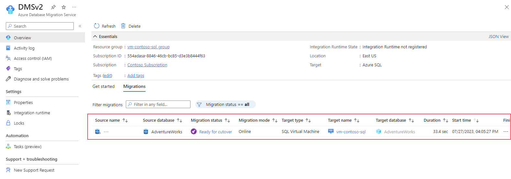

---
lab:
  title: 将 SQL Server 数据库迁移到 Azure 虚拟机上的 SQL Server
---

# 将 SQL Server 数据库迁移到 Azure 虚拟机上的 SQL Server

在本练习中，你将了解如何使用适用于 Azure Data Studio 的 Azure 迁移扩展将 SQL Server 数据库迁移到运行在 Azure 虚拟机上的 SQL Server。 首先要安装并启动 Azure Data Studio 的 Azure 迁移扩展。 然后，您将执行 SQL Server 数据库到运行在 Azure 虚拟机上的 SQL Server 的在线迁移。 您还将学习如何在 Azure 门户上监控迁移过程，并完成切换过程以最终完成迁移。

该练习大约需要 **45** 分钟。

> **注意**：若要完成此练习，需要访问 Azure 订阅以创建 Azure 资源。 如果没有 Azure 订阅，请在开始之前创建一个[免费帐户](https://azure.microsoft.com/free/?azure-portal=true)。

## 准备工作

要运行此练习，您需要：

| 项 | 说明 |
| --- | --- |
| **目标服务器** | Azure 虚拟机上的 SQL Server。 要了解更多信息，请访问[在 Azure 虚拟机上配置 SQL Server](https://microsoftlearning.github.io/dp-300-database-administrator/Instructions/Labs/01-provision-sql-vm.html)。 **注意：** 目标和服务器之间的 SQL Server 版本必须相同。 |
| **源服务器** | 安装在所选服务器上的最新 [SQL Server](https://www.microsoft.com/en-us/sql-server/sql-server-downloads) 版本。 |
| **源数据库** | 要在 SQL Server 2022 实例上恢复的轻量级 [AdventureWorks](https://learn.microsoft.com/sql/samples/adventureworks-install-configure) 数据库。 |

## 使用 blob 容器配置 Azure 存储账户

创建 Azure 存储账户的目的是为迁移存储完整备份和事务日志备份。 我们稍后将在本练习中使用该存储账户。

1. 登录 [Azure 门户](https://portal.azure.com/)。
1. 在左侧门户菜单中，选择**存储帐户**以显示存储帐户的列表。 如果门户菜单不可见，请单选择菜单按钮将其打开。
1. 在**存储帐户**页上，选择**创建**。
1. 在**项目详细信息**下，选择与创建 Azure 虚拟机相同的 Azure 订阅。
1. 选择与创建 Azure 虚拟机时相同的资源组。 
1. 为存储帐户选择一个唯一的名称，并选择与 Azure 虚拟机相同的区域。
1. 选择**标准**作为服务级别。
1. 将所有其余选项保留为默认值。
1. 依次选择**查看 + 创建**、**创建**。

创建存储帐户后，可以按照以下步骤创建容器：

1. 在 Azure 门户中，导航到新创建的存储帐户。
1. 在存储账户的左侧菜单中，滚动到 **Blob 服务**并选择**容器**。
1. 选择 **+ 容器**来新建容器。
1. 在新建容器页面，提供以下信息：
    - **名称：***您偏好的名称*
    - **公共访问级别：** 私有
1. 选择**创建**。

## 安装并启动 Azure Data Studio 的 Azure 迁移扩展

在开始使用 Azure 迁移扩展之前，需要安装 [Azure Data Studio](https://learn.microsoft.com/sql/azure-data-studio/download-azure-data-studio)。 在这种情况下，请在源数据库所在的同一服务器上安装 Azure Data Studio。 Azure Data Studio 市场中提供了该扩展。

要安装迁移扩展，请执行以下步骤：

1. 在 Azure Data Studio 中打开扩展管理器。
1. 搜索***Azure SQL 迁移***并选择该扩展。
1. 安装该扩展。 安装后，Azure SQL 迁移扩展就会出现在已安装扩展的列表中。
1. 连接到 Azure Data Studio 中的 SQL Server 实例。
1. 要启动 Azure 迁移扩展，请右键单击源实例名称并选择**管理**，以访问 Azure SQL 迁移扩展的控制面板和登陆页面。

## 将 SQL Server 数据库在线迁移到在 Azure 虚拟机上运行的 SQL Server

要使用 Azure Data Studio 执行停机时间最短的迁移，请按照以下步骤操作：

1. 在 Azure Data Studio 扩展中启动迁移到 Azure SQL 向导。

1. 在**步骤 1：评估数据库**中，选择要迁移的数据库，然后选择**下一步**。
    
    > **注意**：建议收集性能数据并获得大小合适的 Azure 建议。

1. 在**第 2 步：评估结果和建议**中，等待评估完成，然后选择 **Azure 虚拟机上的 SQL Server** 作为 **Azure SQL** 目标。

1. 在**步骤 2：评估结果和建议**页面底部，选择**查看/选择**查看评估结果。 选择要迁移的数据库。 

    > **注意**：花一点时间查看右侧的评估结果。

1. **第 3 步：Azure SQL 目标**，选择 Azure 帐户和 Azure 虚拟机上的目标 SQL Server。

    

1. **第 4 步：Azure 数据库迁移服务**，使用 Azure Data Studio 向导创建新的 Azure 数据库迁移服务。 如果以前创建过一个，则可以重复使用。 或者，也可以通过 Azure 门户创建 Azure 数据库迁移服务资源。

    > **注意**：确保订阅已注册，以便使用 **Microsoft.DataMigration** 命名空间。 要了解如何进行资源提供程序注册，请参阅[注册资源提供程序](https://learn.microsoft.com/azure/dms/quickstart-create-data-migration-service-portal#register-the-resource-provider)。

1. 备份源数据库。 可以使用 [SSMS 或 T-SQL 备份到 Microsoft Azure Blob Storage](https://learn.microsoft.com/en-us/sql/relational-databases/backup-restore/sql-server-backup-to-url)。 或者，也可以选择使用 Azure 门户将数据库备份手动复制到容器文件夹。

    > **注意**：确保在容器中创建文件夹后再继续复制备份文件。

1. 在**步骤 5：数据源配置**中，选择数据库备份的位置，可以是内部网络共享，也可以是 Azure Blob Storage 容器。

1. 在 Azure Data Studio 中启动数据库迁移并监视进度。 还可以在 Azure 门户中的 Azure 数据库迁移服务资源下跟踪进度。

    > **注意**：Azure 数据迁移服务将在目标服务器上自动协调和恢复备份文件。

1. 在迁移仪表板中选择**正在进行的数据库迁移**以查看正在进行的迁移。 

    

1. 选择数据库名称以获取更多详细信息。

    

## 在 Azure 门户上监控迁移

或者，还可使用 Azure 数据库迁移服务监视迁移活动。 

1. 
    
    
## 完成切换过程

1. [备份源数据库的尾部日志](https://learn.microsoft.com/sql/relational-databases/backup-restore/tail-log-backups-sql-server)。

1. 在 Azure 门户上，将事务日志备份上传到完整备份文件所在的容器和文件夹。

1. 在 Azure 迁移扩展上，在监控页面中选择**完成切换**。

    

1. 验证是否已在目标数据库上还原了所有日志备份。 **日志备份待还原**值应为零。 此步骤完成迁移。

    

1. 迁移完成后，迁移状态属性将变为**完成**，然后变为**成功**。

    > **注意**：你可以通过 Azure 门户使用 Azure 数据库迁移服务，使用类似的步骤完成切换。

1. 状态为**成功**后，导航到目标服务器，并验证目标数据库。 检查数据库架构和数据。

您已经了解了如何使用 Azure Data Studio 的 Azure 迁移扩展将 SQL Server 数据库迁移到在 Azure 虚拟机上运行的 SQL Server。 你还学会了如何完成切换过程以最终完成迁移。 这将确保所有数据已成功迁移，并且新数据库已完全运行。 一旦切换过程完成，您就可以开始使用在 Azure 虚拟机上运行的新 SQL Server 数据库。 

## 清理

在自己的订阅中操作时，最好在项目结束时确定是否仍需要已创建的资源。 

让资源不必要地运行可能会导致额外的成本。 可以在 [Azure 门户](https://portal.azure.com?azure-portal=true)中单独删除资源或删除整套资源。

## 详细信息

有关 Azure 虚拟机上 SQL Server 的更多信息，请参阅[什么是 Azure 虚拟机上的 SQL Server](https://learn.microsoft.com/en-us/azure/azure-sql/virtual-machines/windows/sql-server-on-azure-vm-iaas-what-is-overview?view=azuresql-vm)？
