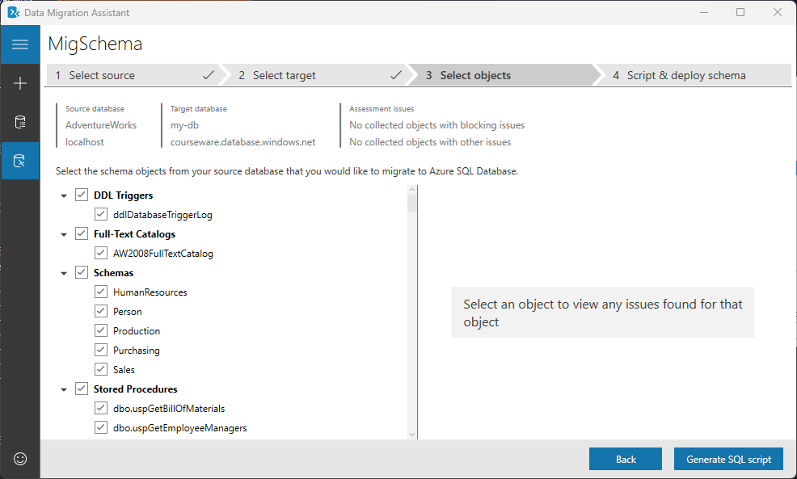
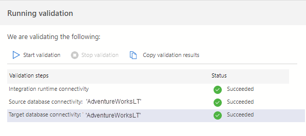
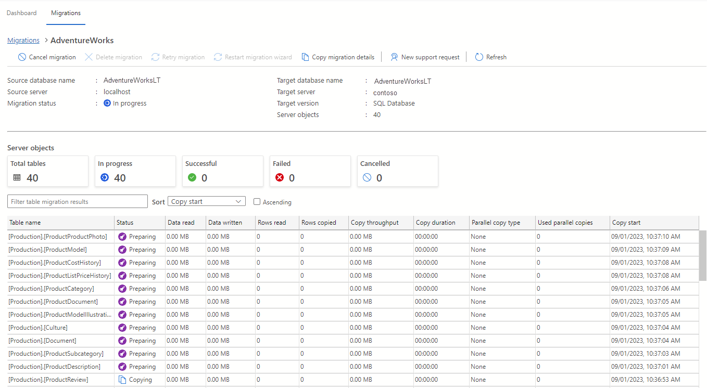

---
lab:
  title: 将 SQL Server 数据库迁移到 Azure SQL 数据库
---

# 将 SQL Server 数据库迁移到 Azure SQL 数据库

在本练习中，你将了解如何使用适用于 Azure Data Studio 的 Azure 迁移扩展将 SQL Server 数据库迁移到 Azure SQL 数据库。 首先要安装并启动 Azure Data Studio 的 Azure 迁移扩展。 然后，将 SQL Server 数据库离线迁移到 Azure SQL 数据库。 您还将学习如何在 Azure 门户上监控迁移过程。

本练习大约需要 **45** 分钟。

> **注意：** 要完成此练习，您需要访问 Azure 订阅以创建 Azure 资源。 如果没有 Azure 订阅，请在开始之前创建一个[免费](https://azure.microsoft.com/free/?azure-portal=true)帐户。

## 开始之前

要运行此练习，需要：

| 项 | 说明 |
| --- | --- |
| **目标服务器** | Azure SQL 数据库服务器。 我们将在本练习中创建它。|
| **目标数据库** | Azure SQL 数据库服务器上的数据库。 我们将在本练习中创建它。|
| **源服务器** | 安装在服务器上的 SQL Server 2019 或[更新版本](https://www.microsoft.com/en-us/sql-server/sql-server-downloads)的实例。 |
| **源数据库** | 要在 SQL Server 实例上还原的轻量级 [AdventureWorks](https://learn.microsoft.com/sql/samples/adventureworks-install-configure) 数据库。 |
| **Azure Data Studio** | 在源数据库所在的同一服务器上安装 [Azure Data Studio](https://learn.microsoft.com/sql/azure-data-studio/download-azure-data-studio)。 如果已经安装，请进行更新，确保使用的是最新版本。 |
| **Microsoft 数据迁移助手** | 在源数据库所在的同一服务器上安装 [Data Migration Assistant](https://www.microsoft.com/en-us/download/details.aspx?id=53595)。 |
| **Microsoft.DataMigration** 资源提供程序 | 确保已注册订阅，以便使用 **Microsoft.DataMigration** 命名空间。 要了解如何进行资源提供程序注册，请参阅[注册资源提供程序](https://learn.microsoft.com/azure/dms/quickstart-create-data-migration-service-portal#register-the-resource-provider)。 |
| **Microsoft Integration Runtime** | 安装 [Microsoft Integration Runtime](https://aka.ms/sql-migration-shir-download)。 |

## 还原 SQL Server 数据库

让我们在 SQL Server 实例中还原 *AdventureWorksLT* 数据库。 该数据库将作为本实验练习的源数据库。 如果数据库已经还原，则可以跳过这些步骤。

1. 选择 Windows 开始按钮，然后键入 SSMS。 从列表中选择**Microsoft SQL Server Management Studio 18**。  

1. 当 SSMS 打开时，请注意，**连接到服务器**对话框将使用默认实例名称预填充。 选择**连接** 

1. 选择**数据库**文件夹，然后选择**新建查询**

1. 在新建查询窗口中，将以下 T-SQL 复制并粘贴到其中。 确保数据库备份文件名和路径与实际备份文件匹配。 否则，命令将失败。 执行查询以还原数据库。

    ```sql
    RESTORE DATABASE AdventureWorksLT
    FROM DISK = 'C:\<FolderName>\AdventureWorksLT2019.bak'
    WITH RECOVERY,
          MOVE 'AdventureWorksLT2019_Data' 
            TO 'C:\<FolderName>\AdventureWorksLT2019.mdf',
          MOVE 'AdventureWorksLT2019_Log'
            TO 'C:\<FolderName>\AdventureWorksLT2019.ldf';
    ```

    > **注意**：在运行 T-SQL 命令之前，请确保 SQL Server 计算机上具有轻型 [AdventureWorks](https://learn.microsoft.com/sql/samples/adventureworks-install-configure#download-backup-files) 备份文件。

1. 还原完成后，应会看到一条成功消息。

## 注册 Microsoft.DataMigration 命名空间

如果已在订阅中注册了 **Microsoft.DataMigration** 命名空间，请跳过这些步骤。

1. 在 Azure 门户中，在顶部的搜索框中搜索**订阅**，然后选择**订阅**。 在订阅刀片上选择**订阅**。

1. 在订阅页面上，选择**设置**下的**资源提供程序**。 在顶部的搜索框中搜索 **Microsoft.DataMigration**，然后选择 **Microsoft.DataMigration**。 

    > **注意**：如果打开了**资源提供程序**详细信息侧边栏，可以将其关闭。

1. 选择“注册”。

## 预配 Azure SQL 数据库

让我们建立一个 Azure SQL 数据库，作为我们的目标环境。

1. 从 Azure 门户，在顶部的搜索框中搜索 **SQL 数据库**，然后选择 **SQL 数据库**。

1. 在**SQL 数据库**边栏选项卡上，选择 **+ 创建**

1. 在**创建 SQL 数据库**页面，选择以下选项。

    - **订阅：**&lt;你的订阅&gt;
    - **资源组：**&lt;你的资源组&gt;
    - **数据库名称：** AdventureWorksLT
    - **服务器：** 选择**创建新**链接。 在**创建 SQL 数据库服务器**页面上提供服务器详细信息。
        - **服务器名称**：&lt;选择服务器名称&gt;。 服务器名称必须是全局唯一的。
        - **位置：**&lt;您的地区，与您的资源组相同&gt;
        - **身份验证方法：** 使用 SQL 身份验证
        - **服务器管理员登录名：** sqladmin
        - **密码：**&lt;您的密码&gt;
        - **确认密码：**&lt;您的密码&gt;
        
            **注意：** 记下此服务器名称和凭据。 您将在后续任务中使用它。

    - **想要使用 SQL 弹性池吗？** 否
    - **工作负载环境：** 生产

1. 在**计算+存储**上，选择**配置数据库**。 在**配置**页上的**服务层**下拉列表中，选择**基本**，然后选择**应用**。

1. 对于**备份存储冗余**选项，请保留默认值：**异地冗余备份存储**。 选择**下一页：网络**。

1. 在**网络**选项卡上，选择**下一步：安全性**，然后选择**下一步：附加设置**。

1. 在**附加设置**页面上，选择**审查 + 创建**。

1. 查看设置，然后选择**创建**。

1. 部署完成后，选择**转到资源**。

## 启用对 Azure SQL 数据库的访问

让我们启用对 Azure SQL 数据库的访问，以便通过客户端工具连接到它。

1. 在**SQL 数据库**页中，选择**概述**部分，然后在顶部选择服务器名称的链接 ：

1. 在 **SQL 服务器**刀片上，选择**安全**部分下的**网络**。

1. 在**公共访问**选项卡上，选择**选定的网络**。 

1. 在**防火墙规则**中，选择** + 添加客户端 IPv4 地址**。

1. 在**例外**中，选中**允许 Azure 服务和资源访问此服务器**属性。 

1. 选择**保存**。

## 在 Azure Data Studio 中连接到 Azure SQL 数据库

在开始使用 Azure 迁移扩展之前，让我们先连接到目标数据库。

1. 启动 Azure Data Studio。

1. 选择**连接**，然后选择**添加连接**。

1. 在**连接详细信息**字段中填写 SQL Server 名称和其他信息。

    > **注意：** 输入之前创建的 SQL Server 的名称。 格式应为 **<server>.database.windows.net**。

1. 在**身份验证类型**中，选择 **SQL 登录**并提供用户名和密码。

1. 选择**连接**。

## 安装并启动 Azure Data Studio 的 Azure 迁移扩展

按照以下步骤安装迁移扩展。 如果扩展已安装，则可跳过这些步骤。

1. 在 Azure Data Studio 中打开扩展管理器。

1. 搜索***Azure SQL 迁移***并选择该扩展。

1. 安装该扩展。 安装后，Azure SQL 迁移扩展就会出现在已安装扩展的列表中。

1. 连接到 Azure Data Studio 中的 SQL Server 实例。 在新连接选项卡中，为**加密**选项选择**可选（假）**。

1. 要启动 Azure 迁移扩展，请右键单击 SQL Server 实例名称并选择**管理**，以访问 Azure SQL 迁移扩展的控制面板和登陆页面。

    > **注意**：如果服务器仪表盘侧栏中看不到 **Azure SQL 迁移**，请重新打开 Azure Data Studio。
 
## 使用 DMA 生成数据库模式

在开始迁移之前，我们需要确保目标数据库中存在模式。 我们使用 DMA 从源数据库创建模式，并将其应用到目标数据库。

1. 启动数据迁移助手。

1. 创建新的迁移项目，将源类型设为 **SQL Server**，目标服务器类型设为 **Azure SQL Database**，迁移范围设为**仅限模式**。 选择**创建**。

     

1. 在**选择源**选项卡上，输入源 SQL Server 实例的名称，并在**身份验证类型**中选择 **Windows 身份验证**。 取消选中**加密连接**。 

1. 选择**连接**。

1. 选择 **AdventureWorksLT** 数据库，然后选择**下一步**。

1. 在**选择目标**选项卡上，输入目标 Azure SQL 服务器的名称，为**身份验证类型**选择 **SQL 服务器身份验证**，并提供 SQL 用户凭据。 

1. 选择 **AdventureWorksLT** 数据库，然后选择**下一步**。

1. 在**选择对象**选项卡上，选择源数据库中的所有模式对象。 选择**生成 SQL 脚本**。 

    

1. 模式生成后，请花一些时间对其进行审查。 一般来说，这一步涉及对脚本进行任何必要的调整，以适应在目标位置无法以当前状态创建的对象，但在本场景中并非如此。
 
1. 您可以使用 Azure Data Studio、SQL Management Studio 或选择**部署模式**手动执行脚本。 使用其中一种方法继续。

    

## 将 SQL Server 数据库离线迁移到 Azure SQL Database

现在我们可以迁移数据了。 请按照以下步骤使用 Azure Data Studio 执行离线迁移。

1. 在 Azure Data Studio 的扩展中启动**迁移到 Azure SQL** 向导，然后选择**迁移到 Azure SQL**。

1. 在**步骤 1：用于评估的数据库**中，选择*AdventureWorks*数据库，然后选择**下一步**。

1. 在**步骤 2：评估结果和建议**中，等待评估完成，然后选择 **Azure SQL Database** 作为 **Azure SQL** 目标。

1. 在**步骤 2：评估结果和建议**页面底部，选择**查看/选择**查看评估结果。 选择要迁移的数据库。

    > **注意**：花一点时间查看右侧的评估结果。

1. 在**第 3 步：Azure SQL 目标**页面，如果账户尚未链接，请确保选择**链接账户**链接添加账户。 然后，选择 Azure 帐户、AD 租户、订阅、位置、资源组、Azure SQL 数据库服务器和 Azure SQL 数据库的凭据。

1. 选择**连接**，然后选择 *AdventureWorks* 数据库作为**目标数据库**。 选择**下一步**。

1. 在**步骤 4：Azure 数据库迁移服务**中，选择**创建新**链接，使用向导创建新的 Azure 数据库迁移服务。 按照向导提供的步骤设置新的自托管集成运行时。 如果以前创建过一个，则可以重复使用。

1. 在**步骤 5：数据源配置**中，输入从自托管集成运行时连接到 SQL Server 实例的凭证。 

1. 选择要从源迁移到目标的所有表。 

1. 选择**运行验证**。

     

1. 验证完成后，选择**下一步**。

1. 在**步骤 6：总结**中，选择**开始迁移**。

1. 在迁移控制面板中选择**正在进行的数据库迁移**，查看迁移状态。 

    

1. 选择 *AdventureWorks* 数据库名称，查看更多详细信息。

    

1. 状态为**成功**后，导航到目标服务器，并验证目标数据库。 检查数据库模式和迁移的数据。

你已经学会了如何安装迁移扩展，以及如何使用数据迁移助手生成数据库模式。 您还学习了如何使用 Azure Data Studio 的 Azure 迁移扩展将 SQL Server 数据库迁移到 Azure SQL 数据库。 迁移完成后，就可以开始使用新的 Azure SQL 数据库资源了。 

## 清理

在自己的订阅中操作时，最好在项目结束时确定是否仍需要已创建的资源。 

让资源不必要地运行可能会导致额外费用。 可以在 [Azure 门户](https://portal.azure.com?azure-portal=true)中单独删除资源或删除整套资源。

## 详细信息

有关 Azure SQL 数据库的更多信息，请参阅[什么是 Azure SQL 数据库](https://learn.microsoft.com/en-us/azure/azure-sql/database/sql-database-paas-overview)。
